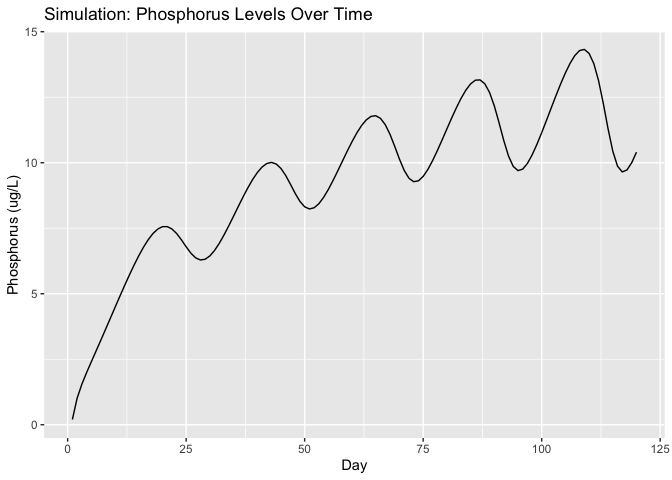
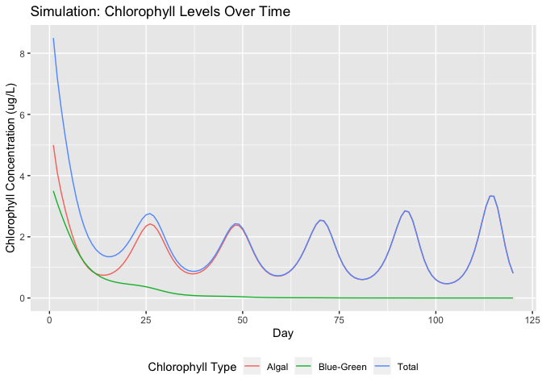
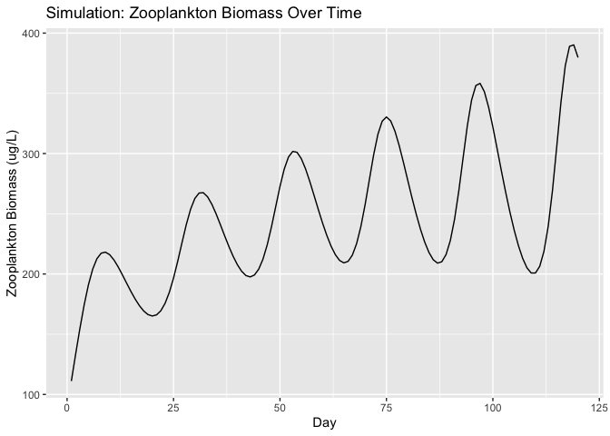
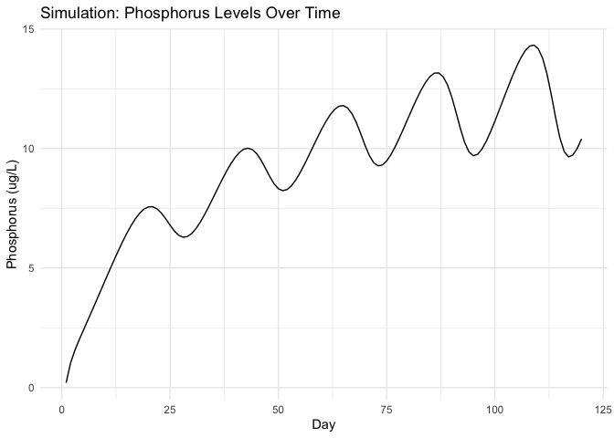

carpentR
================

This R Package implements a model from Stephen R. Carpenter’s 1992 \[1\]
[paper](https://doi.org/10.1007/978-1-4612-4410-3_23) on predicting lake
algal blooms using plankton dynamics and other variables, and was
developed specifically for use in Sam Fey’s Ecology class at Reed
College.

The developmental version of this package can be installed with the
following code:

``` r
# install the remotes package (if you haven't yet)
# install.packages("remotes")

# install the carpentR package!
remotes::install_github("simonpcouch/carpentR")
library(carpentR)
```

Each of the functions exported by this package begin with the prefix
`carpenter_*`–typing the first few letters will show all of the
different functions available in {carpentR}\!

The primary function from this package is called `carpenter_model`,
which runs the simulations detailed in the paper based on the parameters
given. An example is shown below\!

``` r
model_data <- carpenter_model(nanoplankter_diameter = 5.0,
                              alga_diameter = 40,
                              length_herbivore = 1,
                              death_rate_herbivore = .1,
                              p_influx_rate = 0.7,
                              p_outflow_rate = 0.0003,
                              mixed_layer_depth = 2.5)

head(model_data)
```

    ##   day phosphorus algal_chlorophyll blue_green_chlorophyll zooplankton_biomass
    ## 1   1   0.200000          5.000000               3.500000            111.1111
    ## 2   2   1.012104          4.114608               3.107484            133.2836
    ## 3   3   1.546669          3.469708               2.753363            154.5941
    ## 4   4   1.990276          2.920184               2.421692            174.1663
    ## 5   5   2.405145          2.434516               2.112013            190.9055
    ## 6   6   2.814555          2.012060               1.828556            203.8984

{carpentR} also provides several functions to interface with this data.
You might be interested in using any of the `carpenter_viz_*` functions:

``` r
carpenter_viz_phosphorus(model_data)
```

<!-- -->

``` r
carpenter_viz_chlorophyll(model_data)
```

<!-- -->

``` r
carpenter_viz_zooplankton(model_data)
```

<!-- -->

The `carpenter_visualize()` function will call each of the three
visualization functions (in the above order), and you can add aesthetic
layers to these plots as you would with any other `ggplot`:

``` r
carpenter_viz_phosphorus(model_data) + ggplot2::theme_minimal()
```

<!-- -->

Finally, the package supplies a function called `carpenter_pivot()` that
allows you to pivot between wide and long data. Here’s an example:

``` r
model_data_long <- carpenter_pivot(model_data)

head(model_data_long)
```

    ## # A tibble: 6 x 3
    ##     day type                   concentration
    ##   <int> <chr>                          <dbl>
    ## 1     1 phosphorus                      0.2 
    ## 2     1 algal_chlorophyll               5   
    ## 3     1 blue_green_chlorophyll          3.5 
    ## 4     1 zooplankton_biomass           111.  
    ## 5     2 phosphorus                      1.01
    ## 6     2 algal_chlorophyll               4.11

Depending on what you want to visualize, either of the default output
structure or the “longer” data will be properly tidy (and thus easier to
use with `ggplot2` and other packages from the `tidyverse`.)

Happy modeling\!

#### A Note on Implementation

Note that “original source code” is mentioned throughout this package’s
source—this is in reference to an original implementation of the model
in Pascal. Please contact the maintainer for inquiries about this
implementation.

#### Contributing

We welcome and encourage others to help us make this package as user
friendly, flexible, and efficient as possible through filing issues and
pull requests\! Please note that the `carpentR` R package is released
with a [Contributor Code of Conduct](CONTRIBUTING.md). By contributing
to this project, you agree to abide by its terms.

#### References

\[1\] Carpenter S.R. (1992) Destabilization of Planktonic Ecosystems and
Blooms of Blue-Green Algae. In: Kitchell J.F. (eds) Food Web Management.
Springer Series on Environmental Management. Springer, New York, NY
